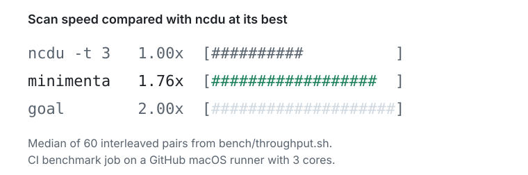
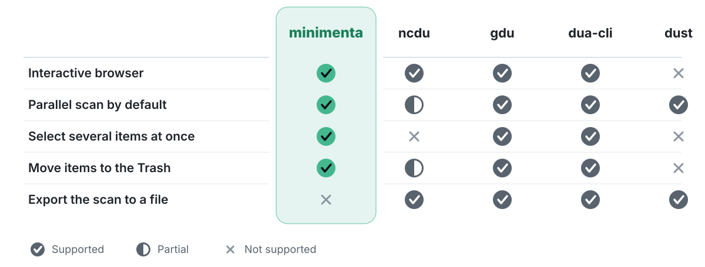

<p align="center">
  
</p>

<p align="center">
  <a href="https://github.com/OriginalMHV/minimenta/actions/workflows/ci.yml"></a>
  <a href="https://www.rust-lang.org"></a>
  
  <a href="#license"></a>
</p>

minimenta is an interactive disk usage analyzer for the terminal, written in Rust. It looks and feels like ncdu, scans faster, and lets you select many items and move them to the Trash in one step.

*Minuere impedimenta* is Latin for "reduce the baggage". *Impedimenta* was the baggage train of a Roman army: everything that slowed it down.

## Why minimenta

- **A start prompt.** Run `minimenta` without a folder. The prompt shows the current folder. Enter scans it, and Tab completes folder names.
- **Multi-select.** Space selects one item. Shift+Up/Down (or `K`/`J`) selects a range. Ctrl+A selects all items in the folder, and Esc clears the selection.
- **The Trash first.** `d` moves the selection to the Trash. On macOS, minimenta asks Finder to do it, so "Put Back" works. If Finder cannot be controlled, minimenta uses the file manager API instead. `D` deletes permanently. Both keys ask for confirmation first: `y` or Enter confirms a move to the Trash, and only `y` confirms a permanent delete. `u` puts the last move to the Trash back, and each further `u` undoes the move before it, until you quit.
- **The ncdu look and keys.** The same layout, size bars, file flags, sort keys and `-x` option. The keys that both tools have work the same, except `d`, which moves items to the Trash.
- **A fast first scan.** At least 16 threads and, on macOS, bulk directory reads with `getattrlistbulk(2)`. On a cold disk, minimenta scans about 4.7x faster than ncdu with its defaults on macOS and about 4.0x faster on Linux (the median of three runs). See [Speed](#speed).
- **Fast repeat scans on macOS.** minimenta keeps the last scan and lists again only the folders that FSEvents reports as changed.

<p align="center">
  
</p>

## Install

```sh
cargo install --git https://github.com/OriginalMHV/minimenta
```

This installs two commands: `minimenta` and its short name `mm`. minimenta runs on macOS, Linux and Windows. Building it needs a recent stable Rust toolchain and a C compiler (for the mimalloc allocator). To build without mimalloc, add `--no-default-features`.

## Usage

```sh
mm                           # ask which folder to scan
mm ~/code                    # scan ~/code at once
mm --summary ~/code          # print the totals without the interface
```

`mm` and `minimenta` are the same program.

1. The prompt shows the current folder. Press Enter to scan it, or type another path. Tab completes folder names and Ctrl+U clears the line.
2. The browser lists the items in the folder, largest first. Open a folder with Enter and go back with Left. The list keeps five rows visible above and below the cursor, and the bottom bar shows the row of the cursor, for example `34/412`.
3. Select the items you do not need, then press `d` to move them to the Trash or `D` to delete them permanently.

Press Esc during a scan to cancel it, or `q` to quit.

## Keys

| Keys | Action |
| --- | --- |
| Up, `k` / Down, `j` | Move the cursor |
| Shift+Up/Down, `K` / `J` | Extend the selection |
| Space | Select or deselect, then move down |
| Ctrl+A / Esc | Select all / clear the selection |
| Enter, Right, `l` | Open the folder |
| Left, `h`, Backspace | Go to the parent folder |
| `d` | Move the selection (or the item under the cursor) to the Trash |
| `D` | Delete permanently |
| `u` | Undo the last move to the Trash (press again for the move before it) |
| `s` / `n` / `C` | Sort by size / name / items (press again to reverse) |
| `a` | Show apparent size or disk usage |
| `r` | Rescan the current folder |
| `?` | Help |
| `q` | Quit |

## Options

| Option | Effect |
| --- | --- |
| `-x`, `--one-file-system` | Do not cross file system boundaries |
| `-t N`, `--threads N` | Use N scan threads (default: the number of CPU cores, at least 16) |
| `--no-cache` | Scan everything, and do not read or write the cache (macOS) |
| `--no-mft` | Do not read the NTFS master file table (Windows) |
| `--cache` | Use the cache together with `--summary`, which scans everything by default |
| `--summary` | Scan, print the totals, and exit |
| `-h`, `--help` | Print the help |
| `-V`, `--version` | Print the version |

## Speed

<p align="center">
  
</p>

The chart shows the median of three runs, and the details below hold every number. The runs differ with the runner CPU: minimenta was 1.8x to 4.9x faster than gdu on Windows, and even with `ncdu -t 64` on Linux.

<details>
<summary>All numbers, the warm scans and the method</summary>

**Measured data.** The chart and the tables come from three runs of the Speed workflow on 2026-10-09: [37934913055](https://github.com/OriginalMHV/minimenta/actions/runs/37934913055), [37934917329](https://github.com/OriginalMHV/minimenta/actions/runs/37934917329) and [37934922096](https://github.com/OriginalMHV/minimenta/actions/runs/37934922096). All three measured main at `b1c0edd` on GitHub-hosted runners. The first ran on main. The other two ran on the temporary refs `speed/run-b` and `speed/run-c` at the same commit. Both refs are deleted. GitHub gave the runs different CPUs, which changes some results a lot (see Runs differ below). Every other number on this page names its own run.

**How to read the numbers.** Each tool runs in alternating pairs with minimenta. The ratio of a tool is the median over the pairs of the time of the tool divided by the time of minimenta. A ratio above 1 means that minimenta is faster. A ratio below 1 means that the tool is faster. A result is even when the middle half of the pair ratios includes 1.

The chart shows a speed relative to a baseline. The baseline is ncdu with its default settings. ncdu does not run on Windows, so the baseline there is gdu. The speed of a tool is the ratio of the baseline divided by the ratio of the tool. The speed of minimenta is the ratio of the baseline. The chart computes each speed in each run and shows the median of the three values. A tool that is slower than the baseline shows below 1.0x. All bars share one scale. Every number is rounded to the digits shown, and an exact tie rounds against minimenta.

<!-- speed-tables:begin -->

**Runs**

| Run | Date | Commit |
| --- | --- | --- |
| [37934913055](https://github.com/OriginalMHV/minimenta/actions/runs/37934913055) | 2026-10-09 | [`b1c0edd`](https://github.com/OriginalMHV/minimenta/commit/b1c0edd04968bd86f37fa42a7b834a43c555085f) |
| [37934917329](https://github.com/OriginalMHV/minimenta/actions/runs/37934917329) | 2026-10-09 | [`b1c0edd`](https://github.com/OriginalMHV/minimenta/commit/b1c0edd04968bd86f37fa42a7b834a43c555085f) |
| [37934922096](https://github.com/OriginalMHV/minimenta/actions/runs/37934922096) | 2026-10-09 | [`b1c0edd`](https://github.com/OriginalMHV/minimenta/commit/b1c0edd04968bd86f37fa42a7b834a43c555085f) |

| Run | Runner | CPU | Cores |
| --- | --- | --- | ---: |
| 37934913055 | macOS | Apple M1 (Virtual) | 3 |
| 37934913055 | Linux | AMD EPYC 9V74 80-Core Processor | 4 |
| 37934913055 | Windows, administrator | AMD64 Family 26 Model 2 Stepping 1, AuthenticAMD | 4 |
| 37934917329 | macOS | Apple M1 (Virtual) | 3 |
| 37934917329 | Linux | AMD EPYC 9V45 96-Core Processor | 4 |
| 37934917329 | Windows, administrator | AMD64 Family 25 Model 1 Stepping 1, AuthenticAMD | 4 |
| 37934922096 | macOS | Apple M1 (Virtual) | 3 |
| 37934922096 | Linux | INTEL(R) XEON(R) PLATINUM 8573C | 4 |
| 37934922096 | Windows, administrator | AMD64 Family 25 Model 1 Stepping 1, AuthenticAMD | 4 |

Times are medians. Pairs shows all pairs, then the pairs in which minimenta was faster and the pairs in which the tool was faster. Speed is the value of the chart.

3 runs. Each value in the tables below is the median of the values of the runs. Pairs add up.

**First scan of a cold disk, macOS, `/opt/homebrew`**

200,140 items. The speed value is relative to ncdu (defaults). This tree is in the chart.

| Tool | Version | Tool time | minimenta time | Ratio | Middle half | Pairs | Faster | Speed |
| --- | --- | ---: | ---: | ---: | --- | --- | --- | ---: |
| ncdu (defaults) | 2.9.2 | 4.44 s | 0.95 s | 4.701 | 3.88 to 5.59 | 45 (44 / 1) | minimenta | 1.0x |
| ncdu -t 64 | 2.9.2 | 1.70 s | 0.91 s | 1.843 | 1.53 to 2.20 | 45 (42 / 3) | minimenta | 2.6x |
| gdu | 5.38.0 | 2.95 s | 0.97 s | 2.484 | 2.25 to 3.28 | 45 (45 / 0) | minimenta | 2.0x |
| dua-cli | 2.45.1 | 1.54 s | 0.86 s | 1.778 | 1.46 to 2.06 | 45 (44 / 1) | minimenta | 2.6x |
| dust | 1.2.6 | 2.65 s | 0.93 s | 2.987 | 2.67 to 3.44 | 45 (45 / 0) | minimenta | 1.6x |

The speed value of minimenta is 4.7x. It is the ratio of the baseline.

**First scan of a cold disk, macOS, `/System/Library`**

427,136 to 427,458 items. The speed value is relative to ncdu (defaults).

| Tool | Version | Tool time | minimenta time | Ratio | Middle half | Pairs | Faster | Speed |
| --- | --- | ---: | ---: | ---: | --- | --- | --- | ---: |
| ncdu (defaults) | 2.9.2 | 10.91 s | 2.61 s | 4.513 | 3.96 to 5.03 | 28 (28 / 0) | minimenta | 1.0x |
| ncdu -t 64 | 2.9.2 | 5.03 s | 2.50 s | 2.034 | 1.82 to 2.37 | 28 (28 / 0) | minimenta | 2.2x |
| gdu | 5.38.0 | 7.91 s | 2.36 s | 3.040 | 2.88 to 3.20 | 28 (28 / 0) | minimenta | 1.4x |
| dua-cli | 2.45.1 | 4.61 s | 2.61 s | 1.746 | 1.63 to 2.04 | 28 (28 / 0) | minimenta | 2.6x |
| dust | 1.2.6 | 7.98 s | 2.57 s | 2.891 | 2.71 to 3.41 | 28 (28 / 0) | minimenta | 1.4x |

The speed value of minimenta is 4.5x. It is the ratio of the baseline.

**First scan of a cold disk, Linux, `/usr`**

737,881 items. The speed value is relative to ncdu (defaults). This tree is in the chart.

| Tool | Version | Tool time | minimenta time | Ratio | Middle half | Pairs | Faster | Speed |
| --- | --- | ---: | ---: | ---: | --- | --- | --- | ---: |
| ncdu (defaults) | 2.9.1 | 31.88 s | 7.90 s | 4.024 | 3.92 to 4.16 | 24 (24 / 0) | minimenta | 1.0x |
| ncdu -t 64 | 2.9.1 | 7.83 s | 7.74 s | 0.999 | 0.99 to 1.03 | 24 (11 / 13) | even | 3.9x |
| gdu | 5.38.0 | 8.55 s | 7.72 s | 1.116 | 1.06 to 1.17 | 24 (22 / 2) | minimenta | 3.6x |
| dua-cli | 2.45.1 | 10.34 s | 7.66 s | 1.347 | 1.33 to 1.37 | 24 (24 / 0) | minimenta | 3.0x |
| dust | 1.2.6 | 9.66 s | 7.65 s | 1.246 | 1.23 to 1.29 | 24 (24 / 0) | minimenta | 3.2x |

The speed value of minimenta is 4.0x. It is the ratio of the baseline.

**First scan of a cold disk, Windows, `C:\Program Files`**

304,060 items. The speed value is relative to gdu. This tree is in the chart.

| Tool | Version | Tool time | minimenta time | Ratio | Middle half | Pairs | Faster | Speed |
| --- | --- | ---: | ---: | ---: | --- | --- | --- | ---: |
| minimenta --no-mft | 0.1.0 | 13.60 s | 4.00 s | 3.455 | 3.25 to 3.69 | 23 (23 / 0) | default scan | 1.3x |
| gdu | 5.38.0 | 18.91 s | 4.13 s | 4.633 | 4.56 to 4.82 | 23 (23 / 0) | minimenta | 1.0x |
| dua-cli | 2.45.1 | 17.94 s | 4.04 s | 4.585 | 4.23 to 4.70 | 23 (23 / 0) | minimenta | 1.0x |
| dust | 1.2.6 | 33.12 s | 3.91 s | 8.556 | 8.12 to 8.89 | 23 (23 / 0) | minimenta | 0.6x |

The speed value of minimenta is 4.6x. It is the ratio of the baseline.

**Scan with a warm cache, macOS, synthetic tree**

51,110 items. From bench/gen_tree.py.

| Tool | Version | Tool time | minimenta time | Ratio | Middle half | Pairs | Faster |
| --- | --- | ---: | ---: | ---: | --- | --- | --- |
| ncdu (defaults) | 2.9.2 | 191.4 ms | 62.0 ms | 3.370 | 2.71 to 4.14 | 180 (180 / 0) | minimenta |
| ncdu -t 3 | 2.9.2 | 85.6 ms | 63.6 ms | 1.412 | 0.95 to 1.68 | 180 (135 / 45) | even |
| ncdu (defaults, binary export) (setting check) | 2.9.2 | 193.0 ms | 64.3 ms | 3.113 | 2.15 to 4.12 | 180 (179 / 1) | minimenta |
| ncdu -t 3 (JSON export) (setting check) | 2.9.2 | 85.5 ms | 69.2 ms | 1.521 | 1.01 to 1.78 | 180 (137 / 43) | minimenta |
| gdu | 5.38.0 | 121.9 ms | 72.0 ms | 1.990 | 1.37 to 2.40 | 180 (169 / 11) | minimenta |
| dua-cli | 2.45.1 | 75.2 ms | 68.3 ms | 1.185 | 0.90 to 1.61 | 180 (123 / 57) | even |
| dust | 1.2.6 | 123.6 ms | 65.1 ms | 1.913 | 1.63 to 2.18 | 180 (174 / 6) | minimenta |

**Scan with a warm cache, Linux, synthetic tree**

51,110 items. From bench/gen_tree.py.

| Tool | Version | Tool time | minimenta time | Ratio | Middle half | Pairs | Faster |
| --- | --- | ---: | ---: | ---: | --- | --- | --- |
| ncdu (defaults) | 2.9.1 | 96.8 ms | 37.2 ms | 2.606 | 2.51 to 2.69 | 180 (180 / 0) | minimenta |
| ncdu -t 4 | 2.9.1 | 33.2 ms | 37.0 ms | 0.926 | 0.88 to 1.04 | 180 (43 / 137) | even |
| ncdu (defaults, binary export) (setting check) | 2.9.1 | 100.0 ms | 36.6 ms | 2.732 | 2.64 to 2.81 | 180 (180 / 0) | minimenta |
| ncdu -t 4 (JSON export) (setting check) | 2.9.1 | 32.7 ms | 37.0 ms | 0.932 | 0.89 to 1.03 | 180 (48 / 132) | even |
| gdu | 5.38.0 | 58.3 ms | 37.1 ms | 1.661 | 1.59 to 1.74 | 180 (180 / 0) | minimenta |
| dua-cli | 2.45.1 | 146.0 ms | 37.3 ms | 3.721 | 3.56 to 3.85 | 180 (180 / 0) | minimenta |
| dust | 1.2.6 | 55.4 ms | 36.9 ms | 1.568 | 1.49 to 1.69 | 180 (180 / 0) | minimenta |

**Scan with a warm cache, Windows, synthetic tree**

51,110 items. From bench/gen_tree.py.

| Tool | Version | Tool time | minimenta time | Ratio | Middle half | Pairs | Faster |
| --- | --- | ---: | ---: | ---: | --- | --- | --- |
| minimenta --no-mft | 0.1.0 | 32.9 ms | 33.3 ms | 0.988 | 0.97 to 1.01 | 180 (63 / 117) | even |
| gdu | 5.38.0 | 85.6 ms | 33.5 ms | 2.591 | 2.52 to 2.69 | 180 (180 / 0) | minimenta |
| dua-cli | 2.45.1 | 90.6 ms | 33.3 ms | 2.703 | 2.64 to 2.74 | 180 (180 / 0) | minimenta |
| dust | 1.2.6 | 770.0 ms | 33.4 ms | 23.120 | 22.87 to 23.50 | 180 (180 / 0) | minimenta |

**Ratio of the cold first scans in each run**

| Platform | Tree | Tool | 37934913055 | 37934917329 | 37934922096 | Median |
| --- | --- | --- | ---: | ---: | ---: | ---: |
| macOS | `/opt/homebrew` | ncdu (defaults) | 4.202 | 4.951 | 4.701 | 4.701 |
| macOS | `/opt/homebrew` | ncdu -t 64 | 2.052 | 1.843 | 1.782 | 1.843 |
| macOS | `/opt/homebrew` | gdu | 2.810 | 2.484 | 2.153 | 2.484 |
| macOS | `/opt/homebrew` | dua-cli | 1.519 | 1.940 | 1.778 | 1.778 |
| macOS | `/opt/homebrew` | dust | 3.154 | 2.793 | 2.987 | 2.987 |
| macOS | `/System/Library` | ncdu (defaults) | 4.138 | 4.513 | 5.024 | 4.513 |
| macOS | `/System/Library` | ncdu -t 64 | 2.349 | 2.034 | 1.948 | 2.034 |
| macOS | `/System/Library` | gdu | 3.040 | 3.153 | 2.739 | 3.040 |
| macOS | `/System/Library` | dua-cli | 1.704 | 1.746 | 1.800 | 1.746 |
| macOS | `/System/Library` | dust | 2.891 | 3.281 | 2.853 | 2.891 |
| Linux | `/usr` | ncdu (defaults) | 4.482 | 4.024 | 3.025 | 4.024 |
| Linux | `/usr` | ncdu -t 64 | 0.958 | 1.020 | 0.999 | 0.999 |
| Linux | `/usr` | gdu | 1.157 | 1.116 | 1.105 | 1.116 |
| Linux | `/usr` | dua-cli | 1.486 | 1.347 | 1.191 | 1.347 |
| Linux | `/usr` | dust | 1.322 | 1.246 | 1.121 | 1.246 |
| Windows | `C:\Program Files` | minimenta --no-mft | 1.492 | 3.649 | 3.455 | 3.455 |
| Windows | `C:\Program Files` | gdu | 1.817 | 4.898 | 4.633 | 4.633 |
| Windows | `C:\Program Files` | dua-cli | 1.681 | 4.721 | 4.585 | 4.585 |
| Windows | `C:\Program Files` | dust | 2.883 | 8.718 | 8.556 | 8.556 |

<!-- speed-tables:end -->

**What the results show**

- **Linux:** `ncdu -t 64` and minimenta are even on a cold disk. The direct ratios of the three runs are 0.96, 1.02 and 1.00, and the median is 1.00. `ncdu -t 64` was faster in 6 of 7 pairs in the first run, and minimenta was faster in 6 of 8 pairs in the second run. In the table, the middle half is 0.99 to 1.03. The chart shows 4.0x against 3.9x only because each row takes its own median across the runs. It is not a lead for minimenta. On the warm tree, `ncdu -t 4` and minimenta are even too (ratio 0.926).
- **macOS:** the data volume (`/opt/homebrew`) is the main result. On `/System/Library`, minimenta skips empty folders without opening them. That works only on the system volume, and the other tools open every folder, so this tree favors minimenta. Cold macOS runs are short. minimenta needs about 1 s for `/opt/homebrew` after `purge`. Read these runs as "after purge", not as raw disk speed. On the warm tree, `ncdu -t 3` and dua-cli are even with minimenta. The middle half is wide because the macOS runner is noisy.
- **Windows:** the runner is an administrator, so minimenta reads the NTFS master file table (MFT). The row `minimenta --no-mft` is a run without administrator rights. The chart shows it as "minimenta (no admin)". In its table row, Tool time is the time of the `--no-mft` scan, and minimenta time is the time of the administrator scan. These medians are 13.60 s and 4.00 s. The ratio is 3.455. It is not 13.60 divided by 4.00 (3.40), because the median of ratios is not the ratio of medians. The MFT read was much slower on one runner CPU type, see Runs differ below. On the warm tree, `minimenta --no-mft` and minimenta are even. The scan takes about 33 ms, which is less than the 50 ms that pass before the MFT reader can start. On this tree, dust needs 770 ms against 33 ms for minimenta. We did not look into why.
- **Microsoft Defender:** real-time monitoring is off on the Windows runner, and `C:\` and `D:\` are excluded. Endpoint security software inspects every directory open. On machines that run it, opening directories takes a large part of the scan time for every tool, and the difference between minimenta and ncdu becomes smaller.
- **dust and dua-cli:** dust prints a tree and is not interactive. dua-cli exits with code 1 on `/System/Library` in all three runs. minimenta reports 10 read errors there in all three runs, so unreadable folders are the likely cause.
- **The 2x goal:** minimenta aims for 2x over ncdu at its best. The cold runs test only one multi-thread setting of ncdu, `-t 64`. Against it, minimenta does not reach 2x in every run. On macOS, the ratio is 2.052, 1.843 and 1.782 on `/opt/homebrew`, and 2.349, 2.034 and 1.948 on `/System/Library`, in the order of the three runs. The medians are 1.843 and 2.034. On Linux, the two tools are even.

**Repeat scans on macOS.** A repeat scan reads the cache and lists again only the folders that FSEvents reports as changed. It does not scan the disk again, so the numbers do not compare with the first scans above. They are not part of the three runs.

- On a 10-core Mac with Microsoft Defender, a repeat scan of trees with 210,000 and 413,000 items takes 0.05 s instead of 2 to 4 s for a full scan. This was measured by hand and has no run ID.
- On the macOS runner, a repeat scan of `/opt/homebrew` (200,140 items) takes 23.1 ms (run 37853798602). The first scan of the same tree takes 0.95 s (the median of the three runs above, on other runners).
- On the macOS runner, a repeat scan of `/Applications/Xcode.app` (156,994 items) takes 21 ms. It took 1,043 ms before PR #21 (run 37853798602), because every repeat scan listed the folders with hard-linked files again. Now minimenta lists them again only when links may have changed.

A scan of `/` on macOS now counts the data volume once. Before, every file behind a firmlink such as `/Users` counted twice. The scan is shorter and the total is lower (240.3 GiB instead of 442.4 GiB, PR #31, run 37855727004), because it does less work. This is a correctness fix. It is not a faster scanner, and none of the numbers above include it.

**How the numbers were measured**

- **Script and workflow.** [`.github/workflows/speed.yml`](.github/workflows/speed.yml) runs [`bench/compare.py`](bench/compare.py) on one GitHub-hosted runner for each platform. The workflow runs when `bench/` changes and on request. [`bench/speed_chart.py`](bench/speed_chart.py) draws the chart and writes the tables from the `speed-merged` artifacts of the runs. gdu, dua-cli, dust and ncdu on Linux come from official release downloads with pinned SHA-256 values ([`bench/install-tools.sh`](bench/install-tools.sh)). ncdu on macOS comes from Homebrew, which builds it from the source release.
- **Pairs.** Each tool runs against minimenta in alternating pairs. The order inside a pair changes from round to round. The script runs as many pairs as the time budget allows. The Pairs column of each table shows how many ran.
- **Commands.** `minimenta --summary`, `ncdu -0 -o /dev/null` (JSON export, default settings), `ncdu -0 -t N -O /dev/null` (binary export), `gdu -n -p -c`, `dua` and `dust -d 0 -P -b -c`. All output goes to the null device. The setting checks run ncdu with the other export format. They are not part of the comparison.
- **Cold disk.** The script drops the operating system file cache before every run. Linux: `sync`, then `echo 3 > /proc/sys/vm/drop_caches`. macOS: `sync`, then `sudo purge`. Windows: it empties the working sets and purges the standby list.
- **The cloud host may still cache the disk.** A first read on a fresh runner was about 8 times slower than a cold run here. The first scan of `/usr` on a fresh Linux runner took minimenta 61.6 s (run 37899170123, no cache drop). Cold scans after a cache drop took a median of 7.9 s (the three runs above). So the cold numbers describe a disk behind a host cache. We did not time the other tools on such a first read, so we do not know if the ratios hold there.
- **Warm cache.** The warm tree is the synthetic tree from [`bench/gen_tree.py`](bench/gen_tree.py): 1,000 folders with 50 empty files each (51,110 items). The operating system cache already holds it. `ncdu -t N` uses one thread for each core of the runner.
- **Allocator.** On the small warm tree, the system allocator is faster than mimalloc. In the Linux job of run 37848716077 (4 cores, 30 pairs each), a build with the system allocator needed 0.93 times as long as the mimalloc build with 16 scan threads. With 4 scan threads, it needed 0.83 times as long. On a warm `/usr` (737,881 items, 10 pairs), it needed 1.03 times as long. Large trees are the common case, so minimenta keeps mimalloc.
- **Totals check.** Before it times anything, the script compares the total size that each tool reports with the total of minimenta. In the three runs, no tool reported a total more than 5% lower, so no tool seems to skip work. The lowest total was from gdu on `/opt/homebrew`, 2.63% lower (run 37934917329). gdu and dust report the apparent size on Windows. On the Windows synthetic tree, dust adds 8.6 MB for the folders themselves.
- **Versions.** The Version column of each table shows them. ncdu is 2.9.2 on macOS (Homebrew) and 2.9.1 on Linux. No static build of ncdu 2.9.2 exists, and ncdu 2.9.2 only fixes a build problem. dua-cli on Linux is the musl build, which is the only x86-64 Linux release file.
- **CI benchmarks.** The benchmark jobs in `ci.yml` ([`bench/cold.sh`](bench/cold.sh), [`bench/throughput.sh`](bench/throughput.sh), [`bench/windows.sh`](bench/windows.sh)) stay as quick checks. The numbers on this page do not come from them.

**Runs differ.** The three runs measured the same commit, but GitHub gave them different runner CPUs, and the ratios change with them. macOS got the same Apple M1 (Virtual) runner type in all three runs. Linux got an AMD EPYC 9V74, an AMD EPYC 9V45 and an Intel Xeon Platinum 8573C. Windows got an AMD64 Family 26 Model 2 CPU in the first run and an AMD64 Family 25 Model 1 CPU in the other two.

- **Windows:** minimenta needed 8.3 s to 8.5 s on the Family 26 CPU and 3.8 s to 4.1 s on the Family 25 CPU. In these three runs, gdu, dua-cli, dust and `minimenta --no-mft` were faster on the Family 26 CPU. For example, gdu needed 14.7 s there, and 20.4 s and 18.9 s on the Family 25 CPU. So the ratio against gdu is 1.817, 4.898 and 4.633 in the order of the runs. The runner image, the administrator rights and the Defender settings were the same in the three jobs. Two older runs agree on the minimenta times. Run 37901931836 got a Family 26 CPU, and minimenta needed 8.1 s to 8.5 s. Run 37904223270 got a Family 25 CPU, and minimenta needed 4.0 s to 4.2 s. The other tools do not agree. gdu needed 18.7 s in run 37901931836 and 18.2 s in run 37904223270, so it was not faster on the Family 26 CPU there. We do not know why the MFT read is slower on the Family 26 CPU.
- **Linux:** ncdu with its defaults needed 35.8 s, 31.9 s and 22.8 s. minimenta needed 8.4 s, 7.9 s and 7.5 s. So the ratio against ncdu with its defaults is 4.482, 4.024 and 3.025. The speed of minimenta in the chart is the median, 4.0x, and the runs give 4.5x, 4.0x and 3.0x. The ratio against gdu moved less, from 1.157 to 1.105.
- **macOS:** the ratio against ncdu with its defaults is 4.202, 4.951 and 4.701 on `/opt/homebrew`, and 4.138, 4.513 and 5.024 on `/System/Library`.

Read every ratio as one sample on the machine types that GitHub gave these runs.

</details>

### Why minimenta is faster

- **More threads.** A scan mostly waits on the disk and the kernel, so minimenta uses at least 16 threads. ncdu uses 1 thread unless you pass `-t`.
- **Bulk reads on macOS.** One `getattrlistbulk(2)` call returns the names, types and sizes of many entries at once. ncdu calls `fstatat` for every file. Linux has no such call, so both tools need one `stat` per file there. On a cold Linux disk, reading the directory blocks takes almost all the time, and the order of those reads decides the speed. In the Linux runs, `ncdu -t 64` is as fast as minimenta.
- **Huge folders on Linux.** One folder with hundreds of thousands of files used to keep one thread busy while the other threads waited. minimenta now splits the stat calls for the later batches of such a folder across threads. On a folder with 200,000 files, minimenta became 2.31x faster when warm and 2.60x faster when cold (run 37854877327, 20 warm pairs and 6 cold pairs). A scan of `/usr` does not change.
- **The master file table on Windows.** As administrator on NTFS, minimenta reads the master file table of the volume in large parallel blocks, as WizTree does, while it lists directories. On a cold disk, this replaces thousands of small reads. The reader starts after 50 ms when the listing is clearly slow (below 40,000 items per second), or later when it is only moderately slow. The first result to finish wins, so a warm scan does not wait for the table. A slow scan (5 s or more) by an administrator whose rights UAC limits ends with a hint to run minimenta as administrator.
- **The cache on macOS.** minimenta keeps the last scan of each folder in `~/Library/Caches/minimenta` and asks FSEvents which directories changed since. It lists only those again. The browser says when it shows a cached scan, and `r` scans everything again.

## minimenta compared with other tools

<p align="center">
  
</p>

Compared on 2026-10-07 with each project's README, manual, help screen or source. Partial means that the tool does part of the row:

- ncdu and gdu reach the macOS Trash only through a custom command: `ncdu --delete-command` or `gdu --trash-command`. The built-in Trash of gdu does not support macOS.
- dua-cli moves marked items to the Trash with the `trash` crate, which asks Finder by default, so "Put Back" works there too.

<details>
<summary>Comparison as text</summary>

| Feature | minimenta | ncdu | gdu | dua-cli | dust |
| --- | --- | --- | --- | --- | --- |
| Start prompt with the current folder | Yes | No (scans the current folder) | No (scans the current folder) | No (scans the current folder) | No |
| Range select with Shift+arrows | Yes | No | No | No | No |
| Select several items at once | Yes | No | Yes (Space) | Yes (Space) | No |
| macOS Trash with Put Back | Yes | Partial (`--delete-command`) | Partial (`--trash-command`) | Yes (Ctrl+T) | No |
| Bulk reads on macOS (`getattrlistbulk`) | Yes | No (`fstatat` per file) | No | Yes | No |

Sources: the [ncdu manual](https://dev.yorhel.nl/ncdu/man) and [scanner source](https://code.blicky.net/yorhel/ncdu/src/branch/zig/src/scan.zig), the [gdu README](https://github.com/dundee/gdu), [help screen](https://github.com/dundee/gdu/blob/master/tui/show.go) and [macOS Trash code](https://github.com/dundee/gdu/blob/master/pkg/remove/trash_darwin.go), the [dua-cli README](https://github.com/Byron/dua-cli), [key bindings](https://github.com/Byron/dua-cli/blob/main/src/config.rs), [options](https://github.com/Byron/dua-cli/blob/main/src/options.rs) and [Trash code](https://github.com/Byron/dua-cli/blob/main/src/interactive/app/deletion.rs), the [trash crate](https://github.com/Byron/trash-rs/blob/master/src/macos/mod.rs), and the [dust README](https://github.com/bootandy/dust). The bulk read cells come from a GitHub code search for `getattrlistbulk` in each repository.

</details>

dua-cli and gdu have features that minimenta does not have, for example search and more platforms, and gdu can export a scan to a file. dust prints a tree and has no interactive mode. Choose minimenta when you want the ncdu look and keys together with a start prompt, range selection and the Trash.

## Development

Before you open a pull request, run the same checks as CI:

```sh
cargo fmt --check
cargo clippy --all-targets -- -D warnings
cargo test
```

`docs/demo/render.sh` records the demo GIF from [`docs/demo/demo.tape`](docs/demo/demo.tape).

## License

Licensed under either of [Apache License, Version 2.0](LICENSE-APACHE) or [MIT license](LICENSE-MIT), at your option.
